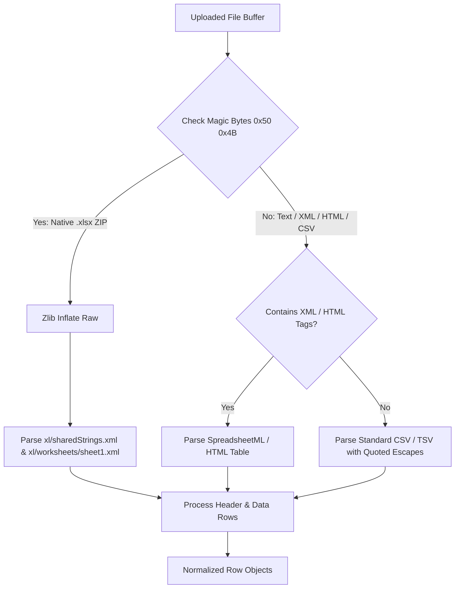

# Complete Import & Export Functionality Documentation

> **System Guide**: Comprehensive technical and operational documentation covering all bulk data import and reporting export capabilities within the platform, with explicit focus on **Production & Excel Data Processing**.

---

## 1. Executive Summary & Architecture Overview

The system provides an enterprise-grade, multi-tenant bulk data **Import & Export Engine** designed for stock, inventory, production, CRM, finance, and worker management.

### Key Architectural Highlights
- **Multi-Tenant Isolation**: All import transactions and exported reports are strictly scoped to the user's `companyId` / `tenantId`.
- **Zero-Dependency Native Excel Parser**: Custom high-performance `.xlsx` ZIP archive decoder using Node.js `zlib` to decompress `xl/sharedStrings.xml` and `xl/worksheets/sheet1.xml` without heavy external npm libraries.
- **Two-Phase Import Workflow**:
  1. **Phase 1: Upload & Preview (`POST /api/v1/imports/upload`)** — Parses file, auto-suggests column mappings, validates row data, detects duplicates against the database, and returns a detailed preview.
  2. **Phase 2: Confirm & Execute (`POST /api/v1/imports/confirm`)** — Runs an atomic Prisma database transaction applying duplicate resolution strategies (`SKIP`, `UPDATE`, `CREATE_NEW`).
- **Resilient Persistence**: Self-healing `import_jobs` table backed by an in-memory fallback store ensuring non-blocking operations.
- **Audit & Stock Movement Ledger**: Automatic creation of `StockMovement` records (`OPENING_STOCK`, `INVENTORY_IMPORT`, `PURCHASE`, `SALE`) for every inventory change caused by imports.
- **Multi-Format Export Engine**: Generates UTF-8 encoded `.csv`, native MS Excel `.xls` (HTML/XML with gridlines and formatted headers), and printable `.pdf` (A4 landscape HTML layout).

---

## 2. Production & Manufacturing Excel Import Mechanics

### 2.1 Overview of Production Data Import
Production management involves manufacturing custom and standard furniture items, tracking raw materials (wood planks, sheets, hardware), finished products, work orders, worker tasks, and stock movements.

When importing production and inventory data from Excel:
1. **Product Categorization**: Production items can be classified as `FINISHED_PRODUCT`, `RAW_MATERIAL`, or `WORK_IN_PROGRESS`.
2. **Opening Stock & Inventory Creation**: Importing product rows automatically initializes an `Inventory` balance record and logs an `OPENING_STOCK` movement.
3. **Auto-Relational Entity Creation**: If a row references a Category or Unit of Measure (e.g. `Piece`, `SqFt`, `Kg`) that does not exist in the company catalog, the system creates it on-the-fly inside the database transaction.

---

### 2.2 File Parser Architecture (`file-parser.service.ts`)

The `FileParserService` accepts `.xlsx`, `.xls`, and `.csv` files. It handles raw binary buffers through a 3-tier parsing pipeline:



#### Native `.xlsx` ZIP Extraction Strategy
- Reads the **Central Directory** at the end of the ZIP buffer (EOCD marker `0x50 0x4B 0x05 0x06`).
- Decodes local file headers and decompress streams (`compMethod === 8` uses `zlib.inflateRawSync`).
- Extracts `xl/sharedStrings.xml` to populate string lookup tables for cell values with `t="s"`.
- Converts cell coordinate references (e.g., `C2` -> Column index 2) to maintain proper tabular structure.

---

### 2.3 Intelligent Column Mapping Engine (`validation.service.ts`)

The `ValidationService` utilizes a multi-pass intelligent alias mapping engine (`ALIAS_MAP`) to auto-map uploaded Excel columns to internal model attributes.

#### Supported Aliases Sample:
| Target Field | Recognized Uploaded Excel Headers |
| :--- | :--- |
| `name` | `Product Name`, `Item Name`, `Name`, `Title`, `Product`, `Item`, `Oduct Nam` |
| `sku` | `SKU`, `Product Code`, `Item Code`, `Code`, `Barcode`, `SKU*` |
| `category` | `Category`, `Category Name`, `Group` |
| `unit` | `Unit`, `Unit Name`, `Unit of Measure`, `UOM` |
| `costPrice` | `Cost Price`, `Cost`, `Purchase Rate`, `Buy Price`, `Unit Cost` |
| `sellingPrice` | `Selling Price`, `Sale Price`, `Sell Price`, `MRP`, `Rate`, `Unit Price` |
| `openingStock` | `Opening Stock`, `Current Stock`, `Qty`, `Quantity`, `Stock` |
| `minimumStock` | `Minimum Stock`, `Reorder Level`, `Min Stock` |

*Fallback logic*: If 0 headers match known aliases (headerless Excel file), the parser defaults to positional column mapping (`Col 1` -> `name`, `Col 2` -> `sku`, etc.).

---

### 2.4 Data Validation & Auto-Healing Rules

Before executing database writes, each row undergoes strict module-level validation:

- **Product Name**: Required. If blank, auto-populates from `description`, `SKU`, or category name `#rowNum`.
- **SKU**: Auto-generated (`SKU-PRODNAME-ROWNUM`) if omitted in Excel.
- **Category & Unit**: Defaulted to `"General"` and `"Piece"` if unspecified.
- **Cost & Selling Prices**: Coerced to numbers; defaulted to `0` if empty; triggers validation error if negative.
- **Stock Quantities**: Must be non-negative numbers.

---

### 2.5 Duplicate Detection & Strategies (`duplicate.service.ts`)

The system queries the database before execution to flag potential duplicates:

| Module | Duplicate Detection Key |
| :--- | :--- |
| **PRODUCTS / INVENTORY** | `sku` |
| **CATEGORIES** | `name` (case-insensitive) |
| **UNITS** | `name` or `shortCode` |
| **CUSTOMERS / SUPPLIERS** | `phone` |
| **WORKERS** | `employeeCode` |
| **SALES** | `invoiceNumber` / `saleNumber` |
| **PURCHASES** | `purchaseNumber` |

#### Resolution Strategies:
1. `SKIP` *(Default)*: Ignore duplicate rows; keep existing records unchanged.
2. `UPDATE`: Overwrite existing record fields with uploaded Excel values.
3. `CREATE_NEW`: Force creation of new records (where schema constraints allow).

---

### 2.6 Transactional Import Execution (`import-transaction.service.ts`)

Imports run inside an isolated Prisma transaction (`prisma.$transaction`) with a 60-second timeout to prevent partial or dirty states:

```typescript
// Transactional flow simplified snippet for PRODUCTS:
for (const row of rows) {
  // 1. Ensure Category exists or create on-the-fly
  let category = await tx.category.findFirst({ where: { companyId, name: { equals: row.category, mode: 'insensitive' } } });
  if (!category) category = await tx.category.create({ data: { companyId, name: row.category.trim() } });

  // 2. Ensure Unit exists or create on-the-fly
  let unit = await tx.unit.findFirst({ where: { companyId, name: { equals: row.unit, mode: 'insensitive' } } });
  if (!unit) unit = await tx.unit.create({ data: { companyId, name: row.unit.trim(), shortCode: row.unit.slice(0, 5).toUpperCase() } });

  // 3. Upsert / Create Product & Inventory Balance
  const product = await tx.product.create({
    data: { companyId, name: row.name, sku: row.sku, categoryId: category.id, unitId: unit.id, purchasePrice: row.costPrice, sellingPrice: row.sellingPrice, openingStock: row.openingStock, currentStock: row.openingStock }
  });
  await tx.inventory.create({ data: { companyId, productId: product.id, currentQuantity: row.openingStock, availableQuantity: row.openingStock } });

  // 4. Record Stock Movement Ledger Entry
  if (row.openingStock > 0) {
    await tx.stockMovement.create({
      data: { companyId, productId: product.id, movementType: 'OPENING_STOCK', quantity: row.openingStock, previousQuantity: 0, newQuantity: row.openingStock, referenceType: 'INITIAL_IMPORT', reason: 'Bulk Data Import Opening Stock', createdBy: userId }
    });
  }
}
```

---

## 3. Supported Import Modules Summary

| Module Type | Required Fields | Created / Updated Entities |
| :--- | :--- | :--- |
| `PRODUCTS` | `Product Name*` | `Product`, `Category`, `Unit`, `Inventory`, `StockMovement` |
| `INVENTORY` | `Product Name*`, `Opening Stock*` | `Product`, `Inventory`, `StockMovement` |
| `PURCHASES` | `Purchase Number*`, `Quantity*`, `Unit Price*` | `Purchase`, `PurchaseItem`, `Supplier`, `Inventory`, `StockMovement` |
| `SALES` | `Invoice Number*`, `Quantity*`, `Unit Price*` | `Sale`, `SaleItem`, `Customer`, `Inventory`, `StockMovement` |
| `CATEGORIES` | `Category Name*` | `Category` |
| `UNITS` | `Unit Name*`, `Short Code*` | `Unit` |
| `CUSTOMERS` | `Customer Name*`, `Phone*` | `Customer`, `CustomerAddress` |
| `SUPPLIERS` | `Supplier Name*`, `Phone*` | `Supplier`, `SupplierAddress` |
| `WORKERS` | `Employee Code*`, `First Name*` | `Worker` (with RBAC check for salary columns) |

---

## 4. Export Engine Architecture (`export.service.ts`)

The Export Engine provides full multi-format reporting across 9 core business domains:

### 4.1 Export Formats
1. **CSV (`.csv`)**: Clean comma-separated file prefixed with UTF-8 BOM (`\uFEFF`) for seamless character rendering in Microsoft Excel without encoding errors.
2. **Excel (`.xls`)**: HTML Spreadsheet XML formatted with styled headers (dark navy `#1E293B`), cell borders, alternating row colors, gridline flags (`<x:DisplayGridlines/>`), and aggregated summary total rows.
3. **PDF / Printable Document (`.html`)**: Styled A4 landscape document complete with header metadata, company name, summary KPI cards, printable stylesheet rules (`@page { size: A4 landscape; }`), and an automatic window print trigger script (`window.print()`).

---

### 4.2 Available Report Types

- **Sales Orders Report** (`sales`): Orders list, customer info, total amount, paid amount, due balance, payment status, and revenue summary.
- **Inventory Valuation & Stock Report** (`inventory`): Complete SKU catalog, current stock levels, cost valuation, retail value, and low stock count.
- **Purchase Orders Report** (`purchases`): PO history, supplier names, total outflow, and outstanding payables.
- **Customer Receivables Report** (`customers`): Customer profiles, order counts, total spent, and outstanding receivables balance.
- **Supplier Payables Report** (`suppliers`): Vendor directory, total purchases, and outstanding vendor dues.
- **Expense Analytics Report** (`expenses`): Expense breakdowns by category, date, and payment mode.
- **Cash Flow & Finance Statement** (`cash-flow` / `finance`): Comprehensive cash inflows (customer receipts) vs outflows (supplier payments, expenses) and net cash flow.

---

## 5. API Reference & Endpoints

### Import Endpoints

| Method | Endpoint | Description |
| :--- | :--- | :--- |
| `POST` | `/api/v1/imports/upload` | Upload `.xlsx` or `.csv` file buffer; receive preview, mappings, and validation report. |
| `POST` | `/api/v1/imports/confirm` | Execute import transaction using specified `duplicateStrategy` (`SKIP`, `UPDATE`, `CREATE_NEW`). |
| `GET` | `/api/v1/imports/template/:module` | Download formatted sample Excel or CSV template for a given module. |
| `GET` | `/api/v1/imports/history` | List historical import jobs for the authenticated company. |
| `GET` | `/api/v1/imports/:id` | Fetch detailed status and log for a specific import job. |
| `GET` | `/api/v1/imports/:id/errors` | Download CSV error report for invalid rows. |

### Export Endpoints

| Method | Endpoint | Description |
| :--- | :--- | :--- |
| `GET` | `/api/v1/analytics/export` | Export business reports (`reportType`, `format`: `csv` \| `excel` \| `pdf`, date range). |

---

## 6. Frontend UI Components

- `ImportButton.tsx`: Trigger button with dropdown options to upload file or download Excel template.
- `ImportModal.tsx`: Step-by-step modal wizard guiding users through:
  - Step 1: File Selection & Template Download.
  - Step 2: Intelligent Column Mapping review.
  - Step 3: Data Preview & Error / Duplicate Summary.
  - Step 4: Execution & Success Summary.
- `FileUploader.tsx`: Drag-and-drop file upload zone supporting `.xlsx`, `.xls`, and `.csv`.
- `ColumnMapper.tsx`: Interactive selector to map uploaded Excel column headers to database attributes.
- `ImportPreview.tsx` & `ValidationErrors.tsx`: Data grid preview showing valid rows, validation errors with downloadable CSV error logs, and duplicate warnings.
- `ExportButton.tsx` & `ColumnSelectorModal.tsx`: Toolbar component enabling quick export to CSV, Excel, or PDF with column customization options.
