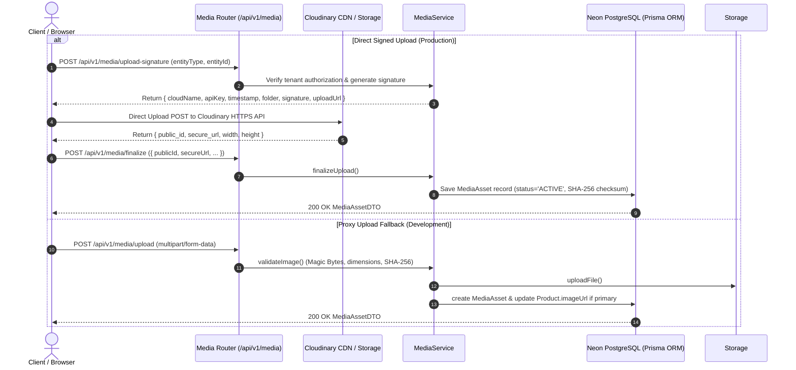

# Backend Product Image Upload Execution Architecture

This document provides a comprehensive technical walkthrough of how **Product Image Uploads** are authorized, validated, stored, and linked in the backend API.

---

## 🏗️ High-Level Architecture Flow Diagram

---

## ⚙️ Key Architectural Pillars

### 1. Single Source of Truth
- `MediaAsset` is the canonical source for all product images.
- Primary image changes operate in a Prisma `$transaction`, resetting all other entity assets `isPrimary = false` and setting selected asset `isPrimary = true`.
- Legacy `Product.imageUrl` is automatically updated as a derived field during primary image operations.

### 2. Direct Signed Uploads (Browser -> Cloudinary)
- Eliminates Express server memory bottlenecks for 5MB images during high traffic.
- Endpoint: `POST /api/v1/media/upload-signature`
- Finalization: `POST /api/v1/media/finalize`

### 3. Binary Magic Bytes & Image Validation (`ImageValidator`)
- File type verification does NOT rely on extensions alone.
- Magic bytes checked:
  - **JPEG**: `FF D8 FF`
  - **PNG**: `89 50 4E 47`
  - **WEBP**: `RIFF....WEBP`
- Dimension limits: Max 4096px width/height, Max 16 Megapixels total resolution.
- SHA-256 checksum calculated per company for upload idempotency.

### 4. Image Variants & Responsive Loading
- Standardized variant transforms:
  - `thumbnail`: 120px x 120px
  - `medium`: 800px max
  - `large`: 1600px max
  - `original`
- Frontend UI component `<ProductImage />` handles variant selection, lazy loading (`loading="lazy"`), and ERP placeholder fallbacks.

### 5. Reliable Multi-Phase Deletion Lifecycle
- `ACTIVE` -> `DELETE_PENDING` -> Cloudinary/Local storage removal -> DB record finalization.
- Automatic fallback: If a deleted image was primary, the next available active image is automatically assigned primary status.
